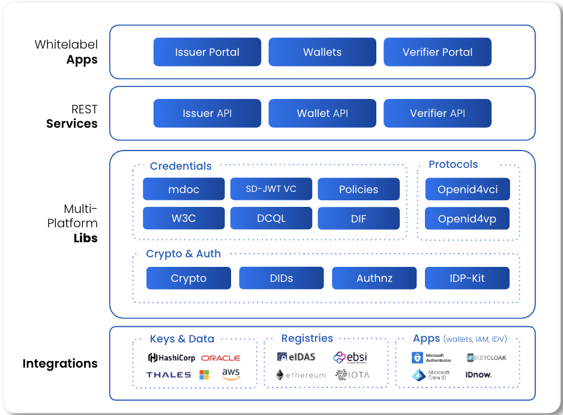
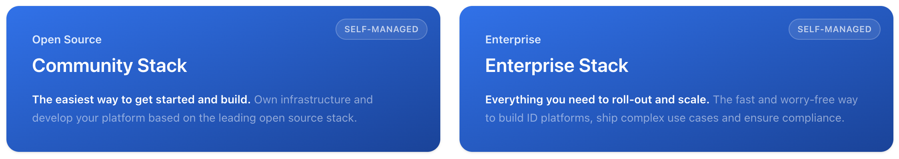

<div align="center">


  <p>Multi-Platform libraries, powerful APIs and easy-to-use white label apps to build identity and wallet solutions <span>by </span><a href="https://walt.id">walt.id</a></p>

<a href="https://github.com/walt-id/waltid-identity/blob/main/LICENSE">

</a>
<a href="https://github.com/walt-id/waltid-identity/releases">

</a>
<a href="https://walt.id/community">

</a>
<a href="https://www.linkedin.com/company/walt-id/">

</a>
</div>

## What is walt.id?

walt.id provides open-source digital ID and wallet infrastructure for issuing, holding and verifying digital identity credentials — standards-based (OpenID4VCI 1.0, OpenID4VP 1.0, HAIP, W3C Verifiable Credentials, SD-JWT VCs, mdoc/mDL) and designed to run entirely on your own infrastructure (on-prem), with no vendor lock-in.


| Issuer                                                 | Wallet                                          | Verifier                                         |
| ------------------------------------------------------ | ----------------------------------------------- | ------------------------------------------------ |
| Issue credentials *(W3C VC, SD-JWT VC, mdoc/mDL)*. | Collect, store, manage and present credentials *(W3C VC, SD-JWT VC, mdoc/mDL)*. | Verify credentials *(W3C VC, SD-JWT VC, mdoc/mDL)* from any compliant ID wallet. |


This repository — the **Community Stack** — is the free, open-source edition of the walt.id product
line. See [Product Editions](#product-editions) below for how it compares to the commercial **Enterprise Stack**.

## Architecture



## Product Editions



**[Get started with the Community Stack](https://docs.walt.id/community-stack)** | **[Learn more about the Enterprise Stack](https://walt.id/pricing)**

## Getting Started

This repository contains a wealth of resources, applications and libraries — the sections below will
help you find the right starting point depending on what you want to do. For deeper concepts and
usage guides, see the [docs site](https://docs.walt.id).

### Test out the walt.id products

All of our APIs are hosted at demo.walt.id. Depending on the service you are interested in, you can visit the following links:

> The links below point to our current v2 APIs (`issuer-api2`, `verifier-api2`, `wallet-api2`). If
> you come across an older `waltid-*-api` service elsewhere in this repo, that's the legacy v1
> implementation — it's still supported but planned for deprecation in favor of v2.

- **Issuer API** - ([Portal](https://portal2.demo.walt.id) | [Swagger](https://issuer2.demo.walt.id/swagger) | [Docs](https://docs.walt.id/community-stack/issuer2/getting-started)  | [GitHub](https://github.com/walt-id/waltid-identity/tree/main/waltid-services/waltid-issuer-api2)) - enable apps to issue credentials (W3C VCs, SD-JWT VCs, mdoc/mDL) via OID4VCI 1.0.
- **Verifier API** - ([Portal](https://portal2.demo.walt.id) | [Swagger](https://verifier2.demo.walt.id/swagger) | [Docs](https://docs.walt.id/community-stack/verifier2/getting-started) | [GitHub](https://github.com/walt-id/waltid-identity/tree/main/waltid-services/waltid-verifier-api2)) - enable apps to verify credentials (W3C VCs, SD-JWT VCs, mdoc/mDL) via OID4VP 1.0.
- **Wallet API** - ([Web App (coming soon)] | [Swagger](https://wallet2.demo.walt.id/swagger) | [Docs](https://docs.walt.id/community-stack/wallet2/getting-started) | [GitHub](https://github.com/walt-id/waltid-identity/tree/main/waltid-services/waltid-wallet-api2)) - extend apps with wallet capabilities to collect, store, manage and share credentials.
- **Wallet SDK** - ([Docs (coming soon)] | [GitHub](https://github.com/walt-id/waltid-identity/tree/main/waltid-libraries/protocols/waltid-openid4vc-wallet)) - a complete wallet library supporting both OpenID4VCI 1.0 and OpenID4VP 1.0.
  - **Compose Wallet** - ([APK via GH Releases](https://github.com/walt-id/waltid-identity/releases) | [Github](https://github.com/walt-id/waltid-identity/tree/main/waltid-applications/waltid-wallet-demo-compose))
  - **iOS Wallet** - (Reach out to [contact@walt.id](mailto:contact@walt.id) for access | [Github](https://github.com/walt-id/waltid-identity/tree/main/waltid-applications/waltid-wallet-demo-ios))

We are still in the process of building new open source portals as well as the new web wallet app to allow you to quickly test out the products!

Use the [walt.id identity package](https://github.com/walt-id/waltid-identity/tree/main/docker-compose) to run all APIs and Apps with docker:

**Clone walt.id identity**

```bash
git clone https://github.com/walt-id/waltid-identity.git && cd waltid-identity
```

**Launch the services**

```bash
cd docker-compose && docker compose up
```

Once the services are up, follow our **[30-minute tutorial](https://docs.walt.id/community-stack/home/tutorial-30-min-v2)** to issue, hold and verify your first credential end-to-end.

Learn more about the docker settings & exposed ports [here](https://github.com/walt-id/waltid-identity/tree/main/docker-compose).

### Build digital credential tooling and applications

If you need even more customisability and control, you can build your own tooling and applications
using the same libraries that we use for the APIs and applications above. We try to provide
multiplatform libraries so you can build application running on JVM, JavaScript and iOS platforms.
Some popular libraries you may want to look at are:

- **Crypto** ([GitHub](https://github.com/walt-id/waltid-identity/tree/main/waltid-libraries/crypto/waltid-crypto)) - create and use keys based on different algorithms and KMS backends (in-memory, AWS, Hashicorp TSE, OCI)
- **DID** ([GitHub](https://github.com/walt-id/waltid-identity/blob/main/waltid-libraries/waltid-did/README.md)) - create, register, and resolve DIDs on different ecosystems.
- **W3C Credentials** ([GitHub](https://github.com/walt-id/waltid-identity/tree/main/waltid-libraries/credentials/waltid-w3c-credentials)) - issue and verify W3C credentials as JWTs and SD-JWTs.
- **mdoc Credentials** ([GitHub](https://github.com/walt-id/waltid-identity/tree/main/waltid-libraries/credentials/waltid-mdoc-credentials2)) - issue and verify mdoc credentials (mDL ISO/IEC 18013-5).
- **SD-JWT** ([GitHub](https://github.com/walt-id/waltid-identity/tree/main/waltid-libraries/sdjwt/waltid-sdjwt)) - create and verify Selective Disclosure JWTs.
- **OpenID4VCI** ([GitHub](https://github.com/walt-id/waltid-identity/tree/main/waltid-libraries/protocols/waltid-openid4vci)) - implementation of the OID4VCI 1.0 protocol. Results from [OpenID Foundation's Conformance Suite (coming soon)]
- **OpenID4VP** ([GitHub](https://github.com/walt-id/waltid-identity/tree/main/waltid-libraries/protocols/waltid-openid4vp)) - implementation of the OpenID4VP 1.0 protocol. Results from [OpenID Foundation's Conformance Suite](https://conformance.waltid.cloud/logs.html)
- **Core Wallet** ([GitHub](https://github.com/walt-id/waltid-identity/tree/main/waltid-libraries/protocols/waltid-openid4vc-wallet)) - implementation of the Core Wallet library supporting both OpenID4VCI 1.0 and OpenID4VP 1.0.


## Join the community

- Connect and get the latest updates: [Discord](https://discord.gg/AW8AgqJthZ) | [Newsletter](https://walt.id/newsletter) | [YouTube](https://www.youtube.com/channel/UCXfOzrv3PIvmur_CmwwmdLA) | [LinkedIn](https://www.linkedin.com/company/walt-id/)
- Get help, request features and report bugs: [GitHub Issues](https://github.com/walt-id/waltid-identity/issues)
- Find more indepth documentation on our [docs site](https://docs.walt.id)


## License

Licensed under the [Apache License, Version 2.0](https://github.com/walt-id/waltid-identity/blob/main/LICENSE)