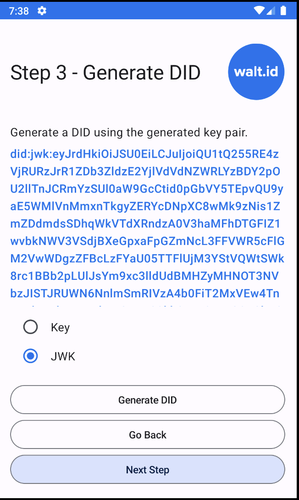
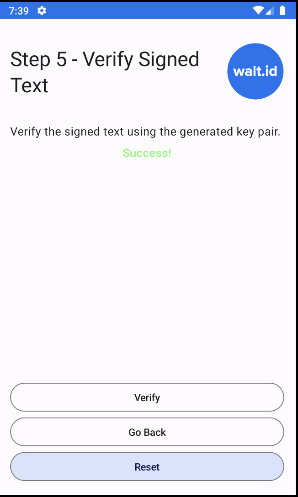

# WALT ID Android Sample Project

This project showcases the capabilities of the WALT ID library, demonstrating how to create keys, sign text, create DIDs (Decentralized Identifiers), and verify signed content.

## Features

1. **Key Generation**: The application allows you to generate keys using different algorithms such as RSA and Secp256r1.

2. **Signing Text**: You can sign any text using the generated keys. The application supports both raw and JWS signing options.

3. **DID Creation**: The application can generate DIDs using the generated keys. It supports both 'key' and 'jwk' methods for DID creation.

4. **Verification**: The application can verify the signed text using the generated keys and DIDs.

## Screenshots

     

## How to Run

1. Clone the repository.
2. Open the project in Android Studio.
3. Run the application on your device or emulator.

## Join the community

* Connect and get the latest updates: <a href="https://discord.gg/AW8AgqJthZ">Discord</a> | <a href="https://walt.id/newsletter">Newsletter</a> | <a href="https://www.youtube.com/channel/UCXfOzrv3PIvmur_CmwwmdLA">YouTube</a> | <a href="https://mobile.twitter.com/walt_id" target="_blank">Twitter</a>
* Get help, request features and report bugs: <a href="https://github.com/walt-id/.github/discussions" target="_blank">GitHub Discussions</a>

## License

**Licensed under the [Apache License, Version 2.0](https://github.com/walt-id/waltid-ssikit/blob/master/LICENSE).**