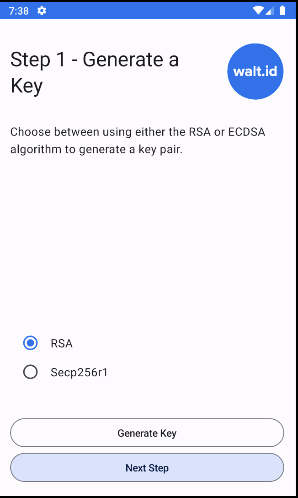
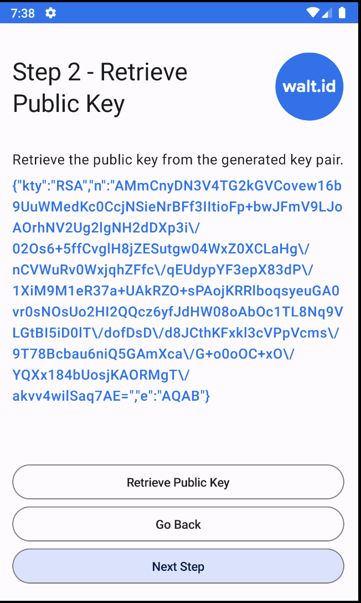
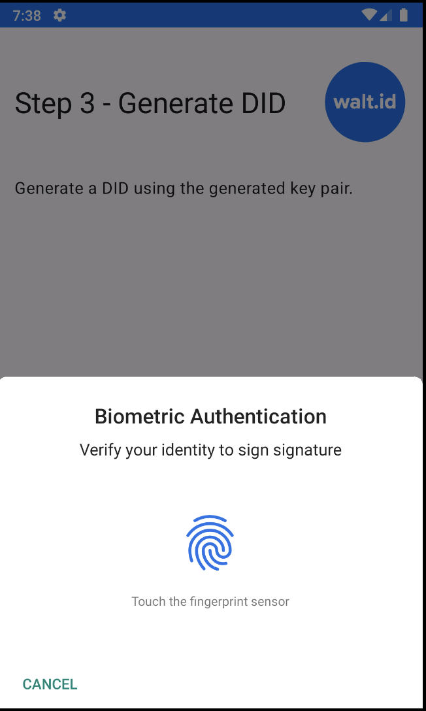
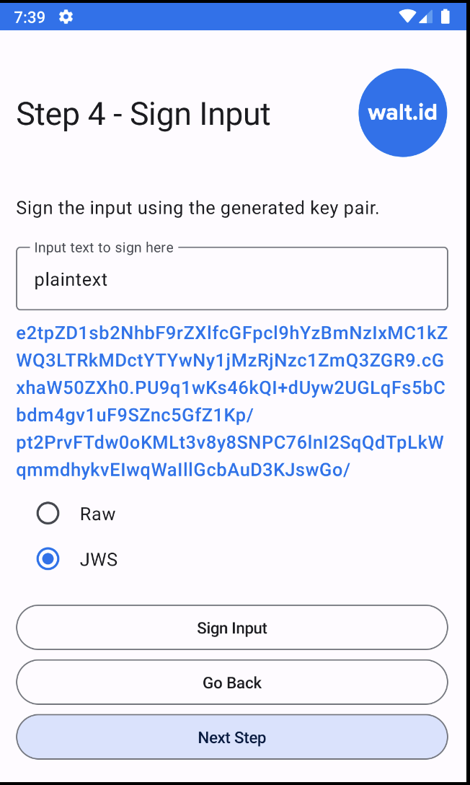

 <h1>Android Sample Project</h1>
 by <a href="https://walt.id">walt.id</a>
 
Sample project showcasing key & DID creation, text signing, and signed content verification.

   
   

   <h2>Status</h2>
   

   
    
   <em>This project is being actively maintained by the development team at walt.id. Regular updates, bug fixes, and new features are being added.</em>
   

## Features

1. **Key Generation**: Generate keys using different algorithms (RSA, Secp256r1).

2. **Text Signing**: Sign text with RAW or JWS signing options. 

3. **DID Creation**: Create DIDs (did:key, did:jwk) based on generated keys. 

4. **Verification**: Verify signed text using generated keys and DIDs.

## Screenshots

     

## How to Run

1. Clone the repository.
2. Open the project in Android Studio.
3. Set your `sdk.dir` in `local.properties` and then enable the Android build
   with `enableAndroidBuild=true` in `gradle.properties`.
4. Run the application on your device or emulator.

## Join the community

* Connect and get the latest updates: [Discord](https://discord.gg/AW8AgqJthZ) | [Newsletter](https://walt.id/newsletter) | [YouTube](https://www.youtube.com/channel/UCXfOzrv3PIvmur_CmwwmdLA) | [LinkedIn](https://www.linkedin.com/company/walt-id/)
* Get help, request features and report bugs: [GitHub Issues](https://github.com/walt-id/waltid-identity/issues)
* Find more indepth documentation on our [docs site](https://docs.walt.id)

## License

Licensed under the [Apache License, Version 2.0](https://github.com/walt-id/waltid-identity/blob/main/LICENSE)

