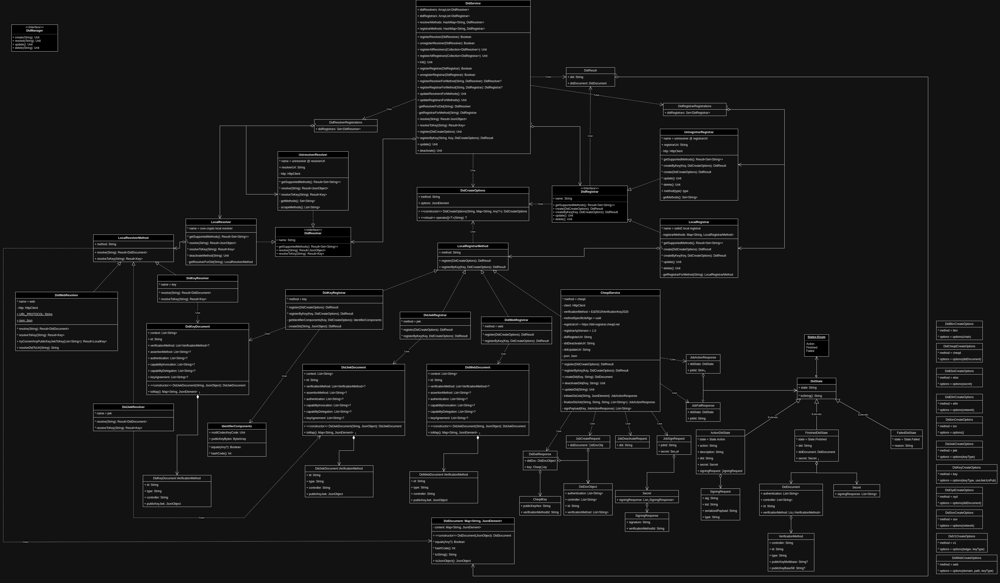

<div align="center">
 <h1>Kotlin Multiplatform DID library</h1>
 <span>by </span><a href="https://walt.id">walt.id</a>

[]()
<a href="https://walt.id/community">

</a>
<a href="https://twitter.com/intent/follow?screen_name=walt_id">

</a>


</div>

## Getting started

_**walt.id did**_ library provides functionality for registering and resolving DIDs.
There are 2 options offered for each function:

- universal - relies on the universal DID registrar / resolver, e.g.:
    - uni-registrar - https://uniregistrar.io
    - uni-resolver - https://dev.uniresolver.io
- local - provides local implementations of DID methods

For the cryptographic part, _**walt.id did**_ library relies on _**walt.id crypto**_ library.

## Class diagram



The top-level interface to access the registrar / resolver functions is provided
by the `DidService` singleton.

## Usage examples

### Register DID

Create the key and register the Did:

```kotlin
val options = DidWebCreateOptions(
    domain = "localhost:3000",
    path = "/path/to/did.json",
    keyType = KeyType.Ed25519
)
val didResult = DidService.register(options = options)
```

Register the Did with the given key:

```kotlin
val key = LocalKey.generate(KeyType.Ed25519)
val options = DidKeyCreateOptions(
  useJwkJcsPub = true
)
val didResult = DidService.register(
    method = "key",
    key = key,
    options = options
)
```

Both calls return a `DidResult` object:

```kotlin
data class DidResult(
    val did: String,
    val didDocument: DidDocument
)
```

where `did` - is the Did url string, while `didDocument` is the corresponding
DidDocument represented as a key-value pair, having the key as a `String` and
value as a `JsonElement`.

Currently available local did methods are:
`key`, `web`, `jwk`.

Currently available universal did methods are:
`btcr`, `cheqd`, `ebsi`, `ethr`, `ion`, `jwk`, `key`,
`oyd`, `sov`, `v1`, `web`.

### Resolve DID

Resolve the Did url to a Did Document:

```kotlin
val did = "did:web:localhost:3000"
val didDocumentResult = DidService.resolve(did = did)
val document = didDocumentResult.getOrNull()
```

Resolve the Did url to its public Key:

```kotlin
val did = "did:key:zmYg9bgKmRiCqTTd9MA1ufVE9tfzUptwQp4GMRxptXquJWw4Uj5cqKBi2vyiwwxC3v7ixvJ8SB9DvDdrK7UemySWDPhvHhUcZ7pgtZtFchLtzK4YC"
val keyResult = DidService.resolveToKey(did = did)
val key = keyResult.getOrNull()
```

Both calls return the result using the _operation result pattern_,
the data being wrapped by the `Result` object. This allows checking for
a successful operation and handling the result accordingly.

The Did Document data is represented as `JsonObject`. The key data is
represented as **_walt.id crypto_** `Key`.


## Local DID operations implemented natively

<table>
    <tbody>
        <!-- header -->
        <tr>
            <td align="center" rowspan="2">Method</td>
            <td align="center" colspan="3">Feature</td>
        </tr>
        <!-- function sub-header -->
        <tr>
            <td align="center">create</td>
            <td align="center">register</td>
            <td align="center">resolve</td>
        </tr>
        <!-- content -->
        <!-- key -->
        <tr>
            <td align="center">key</td>
            <td align="center">&check;</td>
            <td align="center">&dash;</td>
            <td align="center">&check;</td>
        </tr>
        <!-- jwk -->
        <tr>
            <td align="center">jwk</td>
            <td align="center">&check;</td>
            <td align="center">&dash;</td>
            <td align="center">&check;</td>
        </tr>
        <!-- web -->
        <tr>
            <td align="center">web</td>
            <td align="center">&check;</td>
            <td align="center">&cross;</td>
            <td align="center">&cross;</td>
        </tr>
        <!-- cheqd -->
        <tr>
            <td align="center">cheqd</td>
            <td align="center">&check;</td>
            <td align="center">&check;</td>
            <td align="center">&cross;</td>
        </tr>
        <!-- ebsi -->
        <tr>
            <td align="center">ebsi</td>
            <td align="center">&cross;</td>
            <td align="center">&cross;</td>
            <td align="center">&cross;</td>
        </tr>
        <!-- iota -->
        <tr>
            <td align="center">iota</td>
            <td align="center">&cross;</td>
            <td align="center">&cross;</td>
            <td align="center">&cross;</td>
        </tr>
    </tbody>
</table>

## Remote DID operations by 3d party services (fallback)

<table>
    <tbody>
        <!-- header -->
        <tr>
            <td align="center" rowspan="2">Method</td>
            <td align="center" colspan="2">Feature</td>
        </tr>
        <!-- function sub-header -->
        <tr>
            <td align="center">register</td>
            <td align="center">resolve</td>
        </tr>
        <!-- content -->
        <!-- key -->
        <tr>
            <td align="center">key</td>
            <td align="center">&check;</td>
            <td align="center">&dash;</td>
        </tr>
        <!-- jwk -->
        <tr>
            <td align="center">jwk</td>
            <td align="center">&check;</td>
            <td align="center">&dash;</td>
        </tr>
        <!-- web -->
        <tr>
            <td align="center">web</td>
            <td align="center">&check;</td>
            <td align="center">&cross;</td>
        </tr>
        <!-- cheqd -->
        <tr>
            <td align="center">cheqd</td>
            <td align="center">&check;</td>
            <td align="center">&check;</td>
        </tr>
        <!-- ebsi -->
        <tr>
            <td align="center">ebsi</td>
            <td align="center">&cross;</td>
            <td align="center">&cross;</td>
        </tr>
        <!-- iota -->
        <tr>
            <td align="center">iota</td>
            <td align="center">&cross;</td>
            <td align="center">&cross;</td>
        </tr>
    </tbody>
</table>