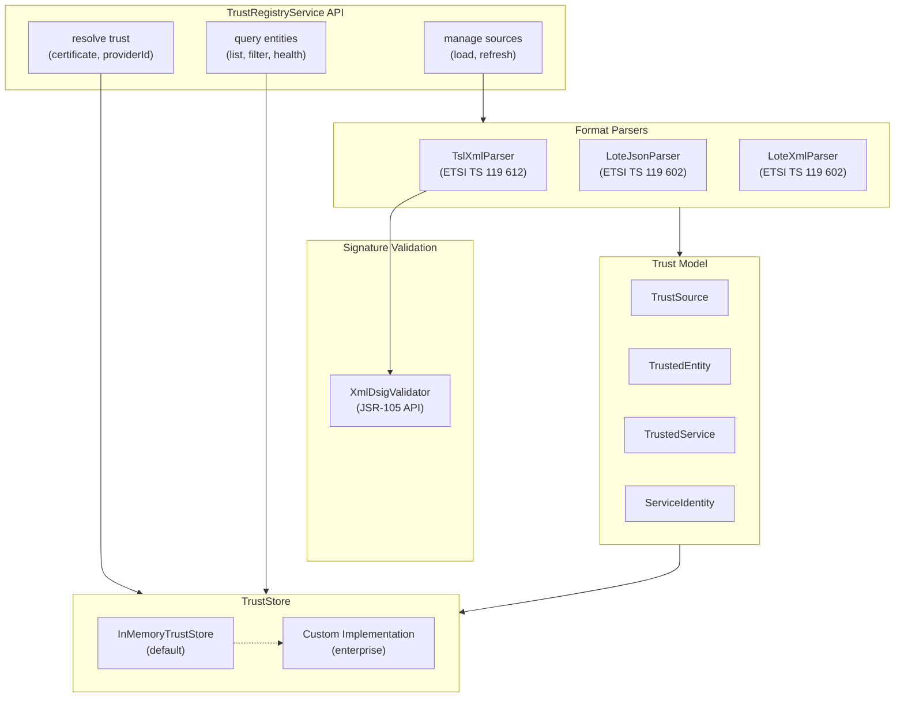

<div align="center">
    <h1>Kotlin Trust Registry Library</h1>
    <span>by </span><a href="https://walt.id">walt.id</a>
    <p>Parse, store, and query EU Trusted Lists and Lists of Trusted Entities</p>
    <a href="https://walt.id/community">
        
    </a>
    <a href="https://www.linkedin.com/company/walt-id/">
        
    </a>
    <h2>Status</h2>
    <p align="center">
        
        <br/>
        <em>This project is being actively maintained by the development team at walt.id.<br />Regular updates, bug fixes, and new features are being added.</em>
    </p>
</div>

A Kotlin/JVM library for parsing and querying trust registries, enabling trust-list support for verifier, issuer, and wallet flows. This library provides the core functionality for resolving whether a certificate, public key, or provider ID is trusted according to EU Trusted Lists (TSL) and EUDI Lists of Trusted Entities (LoTE).

## Features

- **Multi-format parsing** — Parse EU Trusted Lists (TSL XML), LoTE JSON, and LoTE XML formats
- **XMLDSig signature validation** — Validate enveloped XMLDSig signatures on TSL documents (JSR-105 API)
- **Unified trust model** — Normalize diverse trust list formats into a consistent data model
- **Certificate resolution** — Resolve trust status by certificate SHA-256, subject DN, or subject key identifier
- **Provider ID lookup** — Query trust status by entity/provider identifier
- **Entity type filtering** — Filter by entity types: Wallet Provider, PID Provider, Attestation Provider, Trust Service Provider, and more
- **Freshness tracking** — Automatic staleness detection based on `nextUpdate` timestamps
- **In-memory store** — Thread-safe in-memory implementation for MVP and demo use
- **Extensible architecture** — Interface-based design for enterprise persistence backends

## Standards

This library implements support for the following standards:

| Standard | Description |
|----------|-------------|
| **ETSI TS 119 612** | EU Trusted List format (TSL) — XML format with XMLDSig signatures |
| **ETSI TS 119 615** | Procedures for EU Member State national trusted lists |
| **ETSI TS 119 602** | Lists of Trusted Entities (LoTE) — JSON and XML data models |
| **EU LOTL** | List of Trusted Lists (aggregated EU trust anchors) |
| **EUDI LoTE** | EUDI Wallet Lists of Trusted Entities |

## Architecture



## Installation

Add the dependency to your `build.gradle.kts`:

```kotlin
repositories {
    maven("https://maven.waltid.dev/releases")
}

dependencies {
    implementation("id.walt:waltid-trust-registry:<version>")
}
```

## Quick Start

### Initialize the Service

```kotlin
import id.walt.trust.service.DefaultTrustRegistryService
import id.walt.trust.store.InMemoryTrustStore

val trustService = DefaultTrustRegistryService(InMemoryTrustStore())
```

### Load a Trust List

```kotlin
// Load from URL (auto-detects format)
val result = trustService.loadSourceFromUrl(
    sourceId = "ewc-pilot",
    url = "https://ewc-consortium.github.io/ewc-trust-list/EWC-TL"
)
println("Loaded ${result.entitiesLoaded} entities")
```

### Resolve Trust

```kotlin
val decision = trustService.resolveByCertificateSha256(
    sha256Hex = "9f3df3b70633c3d23f5ef04d5d1e7f1d...",
    instant = Clock.System.now()
)

if (decision.decision == TrustDecisionCode.TRUSTED) {
    println("Trusted! Entity: ${decision.matchedEntity?.legalName}")
}
```

## Working Examples with Real Trust Lists

### Example 1: Austrian National TSL (ETSI TS 119 612 XML)

The Austrian Trusted List contains qualified trust service providers and their services with XMLDSig signatures.

```kotlin
// Load Austrian TSL with signature validation
val result = trustService.loadSourceFromUrl(
    sourceId = "at-tsl",
    url = "https://www.signatur.rtr.at/currenttl.xml",
    validateSignature = true  // Validates XMLDSig → AuthenticityState.VALIDATED
)

println("Austria TSL: ${result.entitiesLoaded} providers, ${result.servicesLoaded} services")
println("Authenticity: ${trustService.listSources().first().authenticityState}")
// Output: Authenticity: VALIDATED

// Query Austrian trust service providers
val austrianProviders = trustService.listTrustedEntities(
    EntityFilter(country = "AT", entityType = TrustedEntityType.TRUST_SERVICE_PROVIDER)
)
austrianProviders.forEach { println("  - ${it.legalName}") }
```

### Example 2: EWC Pilot Trust List (LoTE JSON)

The European Wallet Consortium pilot trust list uses the LoTE JSON format for wallet and PID providers.

```kotlin
// Load EWC Pilot (LoTE JSON format - no signature)
val result = trustService.loadSourceFromUrl(
    sourceId = "ewc-pilot",
    url = "https://ewc-consortium.github.io/ewc-trust-list/EWC-TL",
    validateSignature = false  // LoTE JSON is unsigned → AuthenticityState.SKIPPED_DEMO
)

println("EWC Pilot: ${result.entitiesLoaded} entities")

// Query wallet providers
val walletProviders = trustService.listTrustedEntities(
    EntityFilter(entityType = TrustedEntityType.WALLET_PROVIDER)
)

// Resolve by provider ID
val decision = trustService.resolveByProviderId(
    providerId = "ewc-wallet-demo",
    instant = Clock.System.now()
)
```

### Example 3: Custom LoTE JSON (Self-Created)

Create your own trust list for testing or internal use:

```kotlin
val customLoTE = """
{
  "version": "1.0",
  "trustList": {
    "listId": "my-org-trust-list",
    "name": "My Organization Trust List",
    "territory": "DE",
    "issueDate": "2026-01-01T00:00:00Z",
    "nextUpdate": "2027-01-01T00:00:00Z"
  },
  "trustedEntities": [
    {
      "entityId": "my-issuer-001",
      "entityType": "PID_PROVIDER",
      "name": "My PID Issuer",
      "country": "DE",
      "services": [
        {
          "serviceId": "pid-issuance",
          "serviceType": "PID_PROVIDER",
          "status": "granted",
          "digitalIdentities": [
            {
              "x509CertificateSha256": "a1b2c3d4e5f6..."
            }
          ]
        }
      ]
    }
  ]
}
"""

val result = trustService.loadSourceFromContent(
    sourceId = "my-org",
    content = customLoTE
)

// Now you can resolve certificates against your trust list
val decision = trustService.resolveByCertificateSha256("a1b2c3d4e5f6...")
```

### Example 4: EU List of Trusted Lists (EU LOTL)

The EU LOTL aggregates pointers to all member state trusted lists:

```kotlin
// Load EU LOTL (contains pointers to member state TSLs)
val result = trustService.loadSourceFromUrl(
    sourceId = "eu-lotl",
    url = "https://ec.europa.eu/tools/lotl/eu-lotl.xml",
    validateSignature = true
)

// Note: EU LOTL contains TSLPointers, not entities directly
// Use it to discover member state TSL URLs
```

## Verification Policy Integration

This library powers the **`etsi-trust-list`** verification policy in [waltid-verification-policies2](../waltid-verification-policies2). The policy validates that credential issuer certificates are trusted according to loaded trust lists.

### Policy Configuration

```json
{
  "policy": "etsi-trust-list",
  "trustLists": [
    "https://www.signatur.rtr.at/currenttl.xml",
    "https://ewc-consortium.github.io/ewc-trust-list/EWC-TL"
  ],
  "expectedEntityType": "PID_PROVIDER",
  "requireAuthenticated": false,
  "validateSignatures": true
}
```

**How it works:**
1. Extracts the certificate chain from the credential's `x5c` header (COSE for mDoc, JWT for SD-JWT/VC)
2. Iterates through the chain (leaf → root) resolving trust for each certificate
3. If any certificate is found trusted in the configured trust lists, verification passes

**Key options:**
- `trustLists`: URLs or inline content of trust lists to load
- `expectedEntityType`: Filter to specific entity type (e.g., `PID_PROVIDER`, `WALLET_PROVIDER`)
- `requireAuthenticated`: If `true`, only accept trust lists with `VALIDATED` XMLDSig signatures
- `validateSignatures`: Enable/disable XMLDSig validation when loading trust lists

See the [waltid-verification-policies2 README](../waltid-verification-policies2/README.md#etsi-trust-list) for full documentation.

## Data Model Reference

### Key Types

| Type | Description |
|------|-------------|
| `TrustSource` | Metadata about a trust list (URL, territory, freshness, authenticity) |
| `TrustedEntity` | An organization in the trust list (TSP, Wallet Provider, PID Provider, etc.) |
| `TrustedService` | A service offered by an entity with its trust status |
| `ServiceIdentity` | Cryptographic identifiers (cert SHA-256, subject DN, SKI) for certificate matching |
| `TrustDecision` | Result of a trust resolution query with matched entity/service and evidence |

### Trust Status Values

These values are mapped from ETSI TS 119 612 `ServiceStatus` URIs. The original URIs follow the pattern:  
`http://uri.etsi.org/TrstSvc/TrustedList/Svcstatus/<status>`

| Status | ETSI URI Pattern | Description |
|--------|------------------|-------------|
| `GRANTED` | `.../granted` | Service is currently trusted (qualified under eIDAS) |
| `RECOGNIZED` | `.../recognisedatnationallevel` | Recognized under national law / mutual recognition |
| `ACCREDITED` | `.../accredited` | Service is accredited |
| `SUPERVISED` | `.../undersupervision` | Service is under supervision |
| `SUSPENDED` | `.../suspended` | Service trust temporarily suspended |
| `REVOKED` | `.../revoked` | Service trust permanently revoked |
| `WITHDRAWN` | `.../withdrawn` | Service has been withdrawn from the list |
| `DEPRECATED` | `.../deprecatedbynationallaw` | Deprecated by national legislation |
| `EXPIRED` | (computed) | Service validity period has ended |
| `UNKNOWN` | (fallback) | Status URI not recognized |

> **Source:** ETSI TS 119 612 V2.4.1, Section 5.5.4 "Service current status"  
> Full URI example: `http://uri.etsi.org/TrstSvc/TrustedList/Svcstatus/granted`

### Authenticity States

These are library-defined values representing XMLDSig signature validation results:

| State | Description |
|-------|-------------|
| `VALIDATED` | XMLDSig signature verified successfully |
| `FAILED` | Signature validation failed or signature missing when required |
| `SKIPPED_DEMO` | Signature validation was disabled (e.g., for testing/demo) |
| `UNKNOWN` | Authenticity not yet determined |

### Freshness States

Library-defined values based on the `nextUpdate` timestamp in trust lists:

| State | Description |
|-------|-------------|
| `FRESH` | Current time is before `nextUpdate` |
| `STALE` | Current time is past `nextUpdate` (should refresh) |
| `EXPIRED` | Source is significantly past `nextUpdate` |
| `UNKNOWN` | No `nextUpdate` timestamp available |

### Entity Types

Mapped from ETSI TS 119 602 and EUDI wallet specifications:

| Type | Description |
|------|-------------|
| `TRUST_SERVICE_PROVIDER` | Qualified trust service provider (eIDAS) |
| `WALLET_PROVIDER` | EUDI Wallet provider |
| `PID_PROVIDER` | Person Identification Data provider |
| `ATTESTATION_PROVIDER` | Attestation provider (QEAA) |
| `ACCESS_CERTIFICATE_PROVIDER` | Access certificate provider |
| `RELYING_PARTY_PROVIDER` | Relying party provider |
| `OTHER` | Other entity type |

### Decision Codes

Library-defined resolution outcomes:

| Code | Description |
|------|-------------|
| `TRUSTED` | Certificate/provider found in trust list with active status |
| `NOT_TRUSTED` | Not found or found with non-active status |
| `STALE_SOURCE` | Trust source is stale (past `nextUpdate`) |
| `MULTIPLE_MATCHES` | Ambiguous: multiple entities matched |
| `UNSUPPORTED_SOURCE` | Source format not supported |
| `PROCESSING_ERROR` | Error during resolution |
| `UNKNOWN` | Could not determine trust status |

## Advanced Usage

### XMLDSig Signature Validation

Validate trust list signatures directly:

```kotlin
import id.walt.trust.signature.XmlDsigValidator

val tslXml = fetchUrl("https://www.signatur.rtr.at/currenttl.xml")
val result = XmlDsigValidator.validate(tslXml)

when (result.state) {
    AuthenticityState.VALIDATED -> {
        println("Signature valid!")
        println("Signer: ${result.signerCertificate?.subjectX500Principal}")
    }
    AuthenticityState.FAILED -> println("Invalid: ${result.details}")
    else -> println("Unexpected: ${result.state}")
}
```

### Entity Filtering

```kotlin
// Combine multiple filters
val activePidProvidersInAT = trustService.listTrustedEntities(
    EntityFilter(
        entityType = TrustedEntityType.PID_PROVIDER,
        country = "AT",
        onlyCurrentlyTrusted = true
    )
)
```

### Health Monitoring

```kotlin
val health = trustService.getSourceHealth()
health.forEach { h ->
    println("${h.displayName}: ${h.freshnessState}, ${h.authenticityState}")
    println("  Entities: ${h.entityCount}, Services: ${h.serviceCount}")
    println("  Next update: ${h.nextUpdate}")
}
```

## Join the community

* Connect and get the latest updates: [Discord](https://discord.gg/AW8AgqJthZ) | [Newsletter](https://walt.id/newsletter) | [YouTube](https://www.youtube.com/channel/UCXfOzrv3PIvmur_CmwwmdLA) | [LinkedIn](https://www.linkedin.com/company/walt-id/)
* Get help, request features and report bugs: [GitHub Issues](https://github.com/walt-id/waltid-identity/issues)
* Find more in-depth documentation on our [docs site](https://docs.walt.id)

## License

Licensed under the [Apache License, Version 2.0](https://github.com/walt-id/waltid-identity/blob/main/LICENSE)

<div align="center">

</div>
