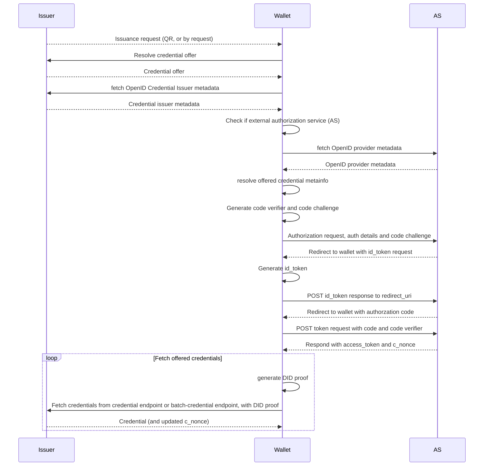

### Issuer

For the full demo issuer implementation, refer to the [CIProvider](https://github.com/walt-id/waltid-identity/blob/main/waltid-services/waltid-issuer-api/src/main/kotlin/id/walt/issuer/issuance/CIProvider.kt) of the waltid-issuer-api demo service.

#### REST endpoints

For the OpenID4VCI issuance protocol, implement the following endpoints:

## Well-defined endpoints:

These endpoints are well-defined, and need to be available under this exact path, relative to your issuer base URL:

* `GET /.well-known/openid-configuration`

* `GET /.well-known/openid-credential-issuer`

Returns the
issuer [provider metadata](https://openid.net/specs/openid-4-verifiable-credential-issuance-1_0.html#name-credential-issuer-metadata).

https://github.com/walt-id/waltid-identity/blob/main/waltid-libraries/protocols/waltid-openid4vc/src/jvmTest/kotlin/id/walt/oid4vc/CITestProvider.kt#L167-L172

See also [here](#configuration-of-issuance-provider) for details about **creating the provider metadata**, required for these endpoints.

## Other required endpoints

These endpoints can have any path, according to your requirements or preferences, but need to be referenced in the provider metadata,
returned by the well-defined configuration endpoints listed above.


* `POST /par`

Endpoint to receive [pushed authorization requests](https://openid.net/specs/openid-4-verifiable-credential-issuance-1_0.html#name-pushed-authorization-reques), referenced in the provider metadata as `pushed_authorization_request_endpoint`, 
see [here](https://www.rfc-editor.org/rfc/rfc9126.html#name-authorization-server-metada).
  
  https://github.com/walt-id/waltid-identity/blob/main/waltid-libraries/protocols/waltid-openid4vc/src/jvmTest/kotlin/id/walt/oid4vc/CITestProvider.kt#L173-L181

* `GET /authorize`

[Authorization endpoint](https://openid.net/specs/openid-4-verifiable-credential-issuance-1_0.html#name-authorization-request), referenced
in provider metadata as `authorization_endpoint`, see [here](https://www.rfc-editor.org/rfc/rfc8414.html#section-2).

Not required for the pre-authorized issuance flow.

https://github.com/walt-id/waltid-identity/blob/main/waltid-libraries/protocols/waltid-openid4vc/src/jvmTest/kotlin/id/walt/oid4vc/CITestProvider.kt#L182-L226

* `POST /token`

[Token endpoint](https://openid.net/specs/openid-4-verifiable-credential-issuance-1_0.html#name-token-endpoint), referenced in provider
metadata as `token_endpoint`, see [here](https://www.rfc-editor.org/rfc/rfc8414.html#section-2).

https://github.com/walt-id/waltid-identity/blob/main/waltid-libraries/protocols/waltid-openid4vc/src/jvmTest/kotlin/id/walt/oid4vc/CITestProvider.kt#L227-L236

* `POST /credential`

[Credential endpoint](https://openid.net/specs/openid-4-verifiable-credential-issuance-1_0.html#name-credential-endpoint) to fetch the issued credential, after authorization flow is completed. Referenced in provider metadata as `credential_endpoint`, as
defined [here](https://openid.net/specs/openid-4-verifiable-credential-issuance-1_0.html#name-credential-issuer-metadata-p).

https://github.com/walt-id/waltid-identity/blob/main/waltid-libraries/protocols/waltid-openid4vc/src/jvmTest/kotlin/id/walt/oid4vc/CITestProvider.kt#L237-L249

See also [here](#crypto-operations-and-credential-issuance) for details about **generating credentials** using the library.

* `POST /credential_deferred`

[Deferred credential endpoint](https://openid.net/specs/openid-4-verifiable-credential-issuance-1_0.html#name-deferred-credential-endpoin),
to fetch issued credential if issuance is deferred. Referenced in provider metadata as `deferred_credential_endpoint`, as
defined [here](https://openid.net/specs/openid-4-verifiable-credential-issuance-1_0.html#name-credential-issuer-metadata-p).

https://github.com/walt-id/waltid-identity/blob/main/waltid-libraries/protocols/waltid-openid4vc/src/jvmTest/kotlin/id/walt/oid4vc/CITestProvider.kt#L250-L265

* `POST /batch_credential`

[Batch credential endpoint](https://openid.net/specs/openid-4-verifiable-credential-issuance-1_0.html#name-batch-credential-endpoint) to
fetch multiple issued credentials. Referenced in provider metadata as `batch_credential_endpoint`, as
defined [here](https://openid.net/specs/openid-4-verifiable-credential-issuance-1_0.html#name-credential-issuer-metadata-p).

**Note:** The batch credential endpoint has been removed from the latest OpenID4VCI specification. Support for the new specification (credentials array in `/credential` response object) is yet to be implemented. 

https://github.com/walt-id/waltid-identity/blob/main/waltid-libraries/protocols/waltid-openid4vc/src/jvmTest/kotlin/id/walt/oid4vc/CITestProvider.kt#L266-L278

## Business logic

For the business logic you can make use of the stateless utility objects `OpenID4VC` and `OpenID4VCI`, providing
utility functions for the necessary steps and operations of the issuance flow, from both the wallet and the issuer side.

### Provider metadata

To **create the provider metadata** object for the well-defined [metadata endpoints](#well-defined-endpoints), you may make use of the helper function in the OpenID4VCI utility object:
[OpenID4VCI::createDefaultProviderMetadata](https://github.com/walt-id/waltid-identity/blob/main/waltid-libraries/protocols/waltid-openid4vc/src/commonMain/kotlin/id/walt/oid4vc/OpenID4VCI.kt#L307),
which creates the metadata based on the issuer base URL, describing the standard API endpoints, response types and signing algorithms.

**Note**, that this utility function does NOT add supported credential types, as it is up to the implementer, which credential types they can support.
See [here](https://github.com/walt-id/waltid-identity/blob/main/waltid-libraries/protocols/waltid-openid4vc/src/commonMain/kotlin/id/walt/oid4vc/providers/OpenIDCredentialIssuer.kt#L42) for an example how to load the list of supported credentials from a configuration.


### Session management

For implementing the issuance flow from the issuer side, you will have to support some kind of session management, where you store state information, authorization requests and results, issuance requests, credential offer, etc. for the current issuance process.
See [here](https://github.com/walt-id/waltid-identity/blob/main/waltid-services/waltid-issuer-api/src/main/kotlin/id/walt/issuer/issuance/CIProvider.kt#L110) for an example of a simple session management and a simple [issuance session object](https://github.com/walt-id/waltid-identity/blob/main/waltid-services/waltid-issuer-api/src/main/kotlin/id/walt/issuer/issuance/IssuanceSession.kt#L12) in our demo implementation of the issuer API.

### Issuance flow

For implementing the issuance flow from the issuer and wallet side, you find here a step-by-step guide, showing the individual steps and examples of how to use the library functions for the necessary data transformation operations.

Here I will show the pre-authorized code flow. For **other supported authorization flow methods**, you can find a sample implementation [here](https://github.com/walt-id/waltid-identity/blob/main/waltid-libraries/protocols/waltid-openid4vc/src/jvmTest/kotlin/id/walt/oid4vc/OpenID4VCI_Test.kt#L196).

#### Common variables
The variables used in both flows, defining the issuer base URL and the issued credential type, are as follows:

```kotlin
val ISSUER_BASE_URL = "https://test"
val ISSUER_TOKEN_KEY = runBlocking { JWKKey.generate(KeyType.RSA) }
val CREDENTIAL_OFFER_BASE_URL = "openid-credential-offer://test"
val issuedCredentialId = "VerifiableId"
```

#### Pre-authorized code flow

**----- ISSUER -----**

**1. Issuer: Generate credential offer**

First we create a pre-authorized code and a credential offer, which we have to store in a session object, to validate it in the following steps.
The pre-authorized code is here a JWT token, that contains the session ID, using a pre-defined token key: `CI_TOKEN_KEY`.

```kotlin
val preAuthCode = OpenID4VC.generateAuthorizationCodeFor(sessionId, metadata.issuer!!, ISSUER_TOKEN_KEY)
val credOffer = CredentialOffer.Builder(ISSUER_BASE_URL)
      .addOfferedCredential(issuedCredentialId)
      .addPreAuthorizedCodeGrant(preAuthCode)
      .build()
```

The **credential offer URL**, that can be shown to the wallet user as a QR code or clickable link, can be generated like this:

```kotlin
val issueReqUrl = OpenID4VCI.getCredentialOfferRequestUrl(credOffer, CREDENTIAL_OFFER_BASE_URL)
```

Example credential offer URL: `openid-credential-offer://test?credential_offer=%7B%22credential_issuer%22%3A%22https%3A%2F%2Ftest%22%2C%22credential_configuration_ids%22%3A%5B%22VerifiableId%22%5D%2C%22grants%22%3A%7B%22urn%3Aietf%3Aparams%3Aoauth%3Agrant-type%3Apre-authorized_code%22%3A%7B%22pre-authorized_code%22%3A%22e43eab06-c052-47f4-9035-a3fc00ebafc0%22%7D%7D%7D`

**----- WALLET -----**

**2. Wallet: Scan and parse credential offer**

Now the wallet has to scan the credential offer link, or the user clicked the link and was redirected to the wallet. 

See here, how to parse and resolve the credential offer and the issuer provider metadata in the wallet:

```kotlin
val credOffer = OpenID4VCI.parseAndResolveCredentialOfferRequestUrl(issueReqUrl)
val providerMetadata = OpenID4VCI.resolveCIProviderMetadata(credOffer)
```

To show the **list of offered credentials** to the user, you can use this utility function:

```kotlin
val offeredCredentials = OpenID4VCI.resolveOfferedCredentials(credOffer, providerMetadata)
```

Find the **pre-authorized code** from the credential offer grants, like this:

```kotlin
val preAuthCode = credOffer.grants[GrantType.pre_authorized_code.value]?.preAuthorizedCode
```

**3. Wallet: Send token request**

Next the wallet has to send a token request to the issuer, to receive the access token, required for fetching the credential.

```kotlin
val tokenReq = TokenRequest(
      grantType = GrantType.pre_authorized_code,
      redirectUri = WALLET_REDIRECT_URI,
      preAuthorizedCode = preAuthCode,
      txCode = null
    )
```

The token request must be sent as a **HTTP POST** request to the token endpoint of the issuer:

```kotlin
providerMetadata.tokenEndpoint
```

**----- ISSUER -----**

**4. Issuer: Receive token request and send response**

The issuer now receives the token request and generates the response:

```kotlin
val params = call.receiveParameters().toMap()
val tokenReq = TokenRequest.fromHttpParameters(params)
```

Validate the pre-authorized code, by validating the signature and parse the token payload:

```kotlin
val payload = OpenID4VC.validateAndParseTokenRequest(tokenRequest, metadata.issuer!!, ISSUER_TOKEN_KEY)
```

Get the session ID from the authorization code and find the issuance session in your session management implementation, e.g.:

```kotlin
val sessionId = payload[JWTClaims.Payload.subject]?.jsonPrimitive?.content
val session = getSession(sessionId) // up to you how to implement session management
```

Generate **access token**, with the sessionID as token subject, for the token response:

```kotlin
val accessToken = OpenID4VC.generateToken(sessionId, ISSUER_BASE_URL, TokenTarget.ACCESS, null, ISSUER_TOKEN_KEY)
```

Generate a **nonce for the proof-of-possession**, which the wallet has to use to create the proof of holder key possession for the credential to issue:

```kotlin
val popNonce = randomUUID()
// update session with proof-of-possession nonce!
session.copy(
  cNonce = popNonce
).also {
  putSession(it.id, it)
}
```

Generate token response and send back to wallet:
```kotlin
val tokenResponse = TokenResponse.success(accessToken, "bearer", cNonce = cPoPNonce, expiresIn = expirationTime)
```

**----- WALLET -----**

**5. Wallet: Receive token response make credential request**

Receive and parse the token response from the issuer:

```kotlin
val params = call.receiveParameters().toMap()
val tokenResponse = TokenResponse.fromHttpParameters(params)
```

Generate the proof of possession for the holder key, which the credential should be bound to:

In this case we assume the wallet key is loaded from a JWK.

```kotlin
val WALLET_KEY = "{...}"
val holderKey = JWKKey.importJWK(WALLET_KEY).getOrThrow()
val holderKeyId = holderKey.getKeyId()
val nonce = tokenResponse.cNonce!!
val proofOfPossession = ProofOfPossession.JWTProofBuilder(providerMetadata.issuer, null, nonce, holderKeyId).build(holderKey)
```

Create credential request, for one of the offered credentials, which we received previously with the credential offer:

```kotlin
val offeredCredential = offeredCredentials.first()
val credReq = CredentialRequest.forOfferedCredential(offeredCredential, proofOfPossession)
```

Post the credential request to the credential endpoint of the issuer, using the access token, received with the token response:

```kotlin
val accessToken = tokenResponse.accessToken!!
val credentialResponse = http.post(providerMetadata.credentialEndpoint!!) {
  contentType(ContentType.Application.Json)
  bearerAuth(accessToken)
  setBody(credReq.toJSON())
}.body<CredentialResponse>()
```

**----- ISSUER -----**

**6. Issuer: Validate credential request and generate credential response**

Parse access token from credential request:

```kotlin
val accessToken = call.request.header(HttpHeaders.Authorization)?.substringAfter(" ")
val parsedToken = accessToken?.let { OpenID4VC.verifyAndParseToken(it, ISSUER_BASE_URL, TokenTarget.ACCESS, ISSUER_TOKEN_KEY) }
```

Parse credential request, from request body:

```kotlin
val credReq = CredentialRequest.fromJSON(call.receive<JsonObject>())
```

Get session ID from token subject and find session in your session management:

```kotlin
val session = parsedToken.get(JWTClaims.Payload.subject)?.jsonPrimitive?.content?.let { getSession(it) }
```

Validate proof of possession:

```kotlin
val nonce = session.cNonce
val validationResult = OpenID4VCI.validateCredentialRequest(credentialRequest, nonce, metadata)
```

If successful, return credential response:

**Note:** credential generation depends on the type of credential and is out-of-scope of this step-by-step guide. 
Refer to [issuer-api demo implementation](https://github.com/walt-id/waltid-identity/blob/main/waltid-services/waltid-issuer-api/src/main/kotlin/id/walt/issuer/issuance/CIProvider.kt#L169), for an example how to generate credentials using the walt.id stack.
Also, refer to the [Credential generation](#credential-generation) section for further instructions.

```kotlin
if(validationResult.success) {
  val credential = generateCredential(credentialRequest, session)
  val responseJSON = CredentialResponse.success(credentialRequest.format, credential).toJSON()
}
```

Finally, return the credential response JSON object to the wallet, as HTTP response body.

#### Credential generation

For generating W3C or SD-Jwt-VC credentials, as required for the `/credential` endpoint, the library provides two helper functions in the OpenID4VCI utility object:
* [OpenID4VCI.generateSdJwtVC](https://github.com/walt-id/waltid-identity/blob/main/waltid-libraries/protocols/waltid-openid4vc/src/commonMain/kotlin/id/walt/oid4vc/OpenID4VCI.kt#L386)
* [OpenID4VCI.generateW3CJwtVC](https://github.com/walt-id/waltid-identity/blob/main/waltid-libraries/protocols/waltid-openid4vc/src/commonMain/kotlin/id/walt/oid4vc/OpenID4VCI.kt#L439)

For an example how to use the utility functions, see [here](https://github.com/walt-id/waltid-identity/blob/main/waltid-services/waltid-issuer-api/src/main/kotlin/id/walt/issuer/issuance/CIProvider.kt#L266-L271).

### Verifier

For the full demo verifier implementation, refer to `/src/jvmTest/kotlin/id/walt/oid4vc/VPTestVerifier.kt`

#### REST endpoints

#### Business logic

### Wallet

#### REST endpoints

#### Business logic

# Example flows:

## EBSI conformance test: Credential issuance:

