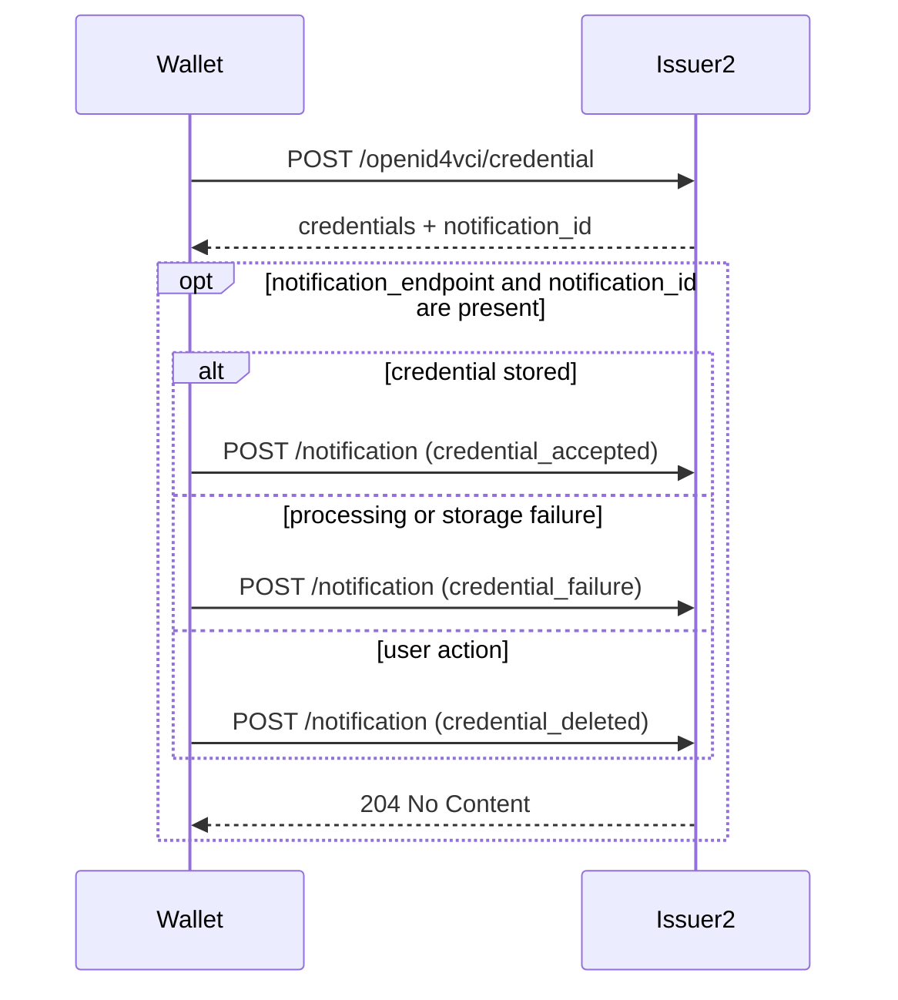

<div align="center">
 <h1>Issuer API 2</h1>
 <span>by </span><a href="https://walt.id">walt.id</a>
 <p>OpenID4VCI 1.0 credential issuance service</p>

<a href="https://walt.id/community">

</a>
<a href="https://www.linkedin.com/company/walt-id/">

</a>
  
  <h2>Status</h2>
  <p align="center">
    
    <br/>
    <em>This project is being actively maintained by the development team at walt.id.<br />Regular updates, bug fixes, and new features are being added.</em>
  </p>
</div>

## Overview

Issuer API 2 is the modern walt.id issuer service for OpenID for Verifiable Credential Issuance (OpenID4VCI) 1.0. It provides profile-based credential offers, OpenID4VCI metadata, authorization and token endpoints, credential issuance, nonce handling, session inspection, and Server-Sent Events for issuance updates.

Use this service for new issuer integrations that need OpenID4VCI 1.0 support. The original `waltid-issuer-api` remains available for draft-based and legacy flows, but is planned for deprecation.

## Features

- **OpenID4VCI 1.0** — Credential offer, authorization, token, nonce, credential, and notification endpoints
- **Credential profiles** — Configurable issuance profiles in `issuer2-profiles.conf`
- **Metadata endpoints** — Credential issuer, authorization server, JWT VC issuer, JWKS, and VCT metadata
- **Grant types** — Pre-authorized code and authorization code flows
- **Session tracking** — Inspect issuance sessions and stream updates via SSE
- **Pluggable persistence** — In-memory by default, Redis-backed repositories when enabled
- **KMS support** — Uses the shared crypto stack, including software keys and cloud-backed integrations

## Running

From the `waltid-identity` root:

```bash
./gradlew :waltid-services:waltid-issuer-api2:run
```

By default the service listens on `0.0.0.0:7005`.

## Configuration

Configuration files live in `config/`:

| File | Purpose |
|------|---------|
| `_features.conf` | Enables optional service features |
| `dev-mode.conf` | Development-mode settings, including DID Web HTTP resolver support |
| `web.conf` | Host and port configuration |
| `issuer-service.conf` | Base URL and issuer token signing key |
| `credential-issuer-metadata.conf` | OpenID4VCI issuer and authorization server metadata |
| `issuer2-profiles.conf` | Credential profiles exposed by the management API |
| `persistence.conf` | In-memory or Redis-backed repository configuration |
| `authentication-service.conf` | Optional external OAuth authentication configuration |

The default `issuer-service.conf` uses `http://localhost:7005` as `baseUrl`. Update this value when deploying behind a public host or reverse proxy so generated metadata and credential offers contain externally reachable URLs.

`walletNotificationEndpointEnabled` controls whether issuer metadata advertises the OpenID4VCI Notification Endpoint. It is enabled by default.

`ciTokenStoredKey` optionally carries an encoded crypto2 `StoredKey` sidecar for `ciTokenKey` and takes precedence at startup. The service validates that both values identify the same signing and verification key. If the sidecar is absent, a legacy JWK is migrated only in memory; the configuration file is never rewritten. A malformed or mismatched sidecar fails startup without falling back to `ciTokenKey`.

## API Endpoints

### Management API

| Method | Path | Description |
|--------|------|-------------|
| `GET` | `/issuer2/profiles` | List configured credential profiles |
| `GET` | `/issuer2/profiles/{profileId}` | Get a credential profile |
| `POST` | `/issuer2/credential-offers` | Create a credential offer |
| `GET` | `/issuer2/sessions` | List issuance sessions |
| `GET` | `/issuer2/sessions/{sessionId}` | Get an issuance session |
| `GET` | `/issuer2/sessions/{sessionId}/events` | Stream issuance session updates via SSE |

### OpenID4VCI API

| Method | Path | Description |
|--------|------|-------------|
| `GET` | `/.well-known/openid-credential-issuer/openid4vci` | Credential issuer metadata |
| `GET` | `/.well-known/oauth-authorization-server/openid4vci` | Authorization server metadata |
| `GET` | `/.well-known/jwt-vc-issuer/openid4vci` | JWT VC issuer metadata |
| `GET` | `/.well-known/vct/{type}` | SD-JWT VC type metadata |
| `GET` | `/openid4vci/jwks` | Issuer signing keys |
| `GET` | `/openid4vci/credential-offer?id={sessionId}` | Credential offer by reference |
| `GET` | `/openid4vci/authorize` | Authorization endpoint |
| `POST` | `/openid4vci/token` | Token endpoint |
| `POST` | `/openid4vci/nonce` | Nonce endpoint |
| `POST` | `/openid4vci/credential` | Credential endpoint |
| `POST` | `/openid4vci/notification` | Notification endpoint |

## Issuance Lifecycle Events

Issuer sessions publish the same `KtorSessionUpdate` envelope to SSE and to an optional webhook configured on the credential offer. The `event` field progresses through the supported OpenID4VCI flow:

| Stage | Events |
|------|--------|
| Offer | `credential_offer_created`, `credential_offer_retrieved` |
| Pushed authorization | `pushed_authorization_request_succeeded`, `pushed_authorization_request_failed` |
| Authorization | `authorization_request_succeeded`, `authorization_request_failed` |
| Unclassified token request | `token_request_failed` |
| Authorization-code token request | `token_request_authorization_code_succeeded`, `token_request_authorization_code_failed` |
| Pre-authorized-code token request | `token_request_pre_authorized_code_succeeded`, `token_request_pre_authorized_code_failed` |
| Refresh-token request | `token_request_refresh_token_succeeded`, `token_request_refresh_token_failed` |
| Nonce request | `nonce_request_succeeded`, `nonce_request_failed` |
| Unresolved credential request | `credential_request_failed` |
| SD-JWT VC credential request | `credential_request_sd_jwt_vc_succeeded`, `credential_request_sd_jwt_vc_failed` |
| W3C VC credential request | `credential_request_w3c_vc_succeeded`, `credential_request_w3c_vc_failed` |
| mdoc credential request | `credential_request_mso_mdoc_succeeded`, `credential_request_mso_mdoc_failed` |
| Session lifecycle | `issuance_status_changed` |

Kotlin enum constants are `SCREAMING_SNAKE_CASE`; webhook and SSE payloads use the lowercase `value` strings above.

### Emission rule

Offer events report management and retrieval facts. Protocol endpoint events report one final outcome. A successful request is emitted only after its protocol response has been constructed.

An event contains the issuance session only after the request has been correlated using trusted protocol state. An unknown code, malformed request, or failure before grant resolution is published only on the issuer-level stream with its request ID and an empty session. The request ID is the Ktor call ID shared by the response `X-Request-ID` header and logging MDC; issuer2 accepts a valid incoming value or generates one when absent. The service does not decode an unverified token merely to obtain a session ID. Notification delivery is best effort and never changes the protocol response.

Nonce request events are always issuer-level. The OpenID4VCI Nonce Endpoint is not protected by an access token and its request contains no issuance-session identifier.

The token event identifies the grant that was processed. Once a trusted issuance session and its credential configuration have been resolved, credential failures use the corresponding `credential_request_<format>_failed` event. Failures before that point use `credential_request_failed` because issuer2 cannot safely assign a format. A request produces at most one endpoint outcome event.

### Failure detail

Failure events carry the protocol error directly on the event envelope:

```json
{ "event": "token_request_pre_authorized_code_failed",
  "error": "invalid_grant",
  "error_description": "tx_code is invalid",
  "session": { "sessionId": "..." } }
```

`error` and `error_description` are the OAuth or OpenID4VCI error returned to the wallet. The event catalogue does not define a second error taxonomy such as `tx_code_validation_failed`; consumers use the specification error and description for diagnosis. For terminal credential failures the object is stored on the session and can be read from `GET /issuer2/sessions/{sessionId}`. Retryable credential proof and nonce failures publish it only on the event because the session remains usable.

### Ordering and delivery

Events raised while handling a single request are delivered in order, on both transports. Concurrent requests on the same session may interleave. `credential_offer_created` is effectively webhook-only: it is published before the session id is returned to the caller, so no SSE subscriber can exist yet.

On successful credential issuance the session is persisted as `SUCCESSFUL` before the credential success event and `issuance_status_changed` are published. A terminal credential failure is persisted as `UNSUCCESSFUL` before the credential failure event and `issuance_status_changed` are published. The status event carries `status`, `statusReason`, and `isClosed`.

Only terminal credential endpoint failures conclude a session. Earlier stages and retryable credential proof or nonce failures leave it usable. An incorrect `tx_code`, for example, does not consume the pre-authorized code, so the wallet can retry and complete the same session.

Published session payloads redact issuer signing key material (`issuerKey.type = "redacted"`). Credential data may still be present; use trusted webhook receivers and avoid exposing event payloads in public logs or screenshots.

### Breaking event-name migration

This catalogue replaces the legacy mixed names. `credential_offer_resolved` becomes `credential_offer_retrieved`; token success/failure names now include the grant; credential `*_issued`, generic failure, DPoP, and proof events become the format-specific credential request outcome; `issuance_status` becomes `issuance_status_changed`. The former `*_received` and `tx_code_validation_failed` events are removed.

## Creating a Credential Offer

Create offers by selecting a configured profile:

```bash
curl -X POST http://localhost:7005/issuer2/credential-offers \
  -H "Content-Type: application/json" \
  -d '{
    "profileId": "UniversityDegree",
    "credentialData": {
      "credentialSubject": {
        "givenName": "Jane",
        "familyName": "Doe"
      }
    }
  }'
```

The response contains the credential offer URL or offer reference that a wallet can use to start the OpenID4VCI flow.

## Wallet Notifications

Issuer2 implements the optional [OpenID4VCI 1.0 Notification Endpoint](https://openid.net/specs/openid-4-verifiable-credential-issuance-1_0-final.html#name-notification-endpoint). When enabled, issuer metadata contains `notification_endpoint`, and a successful Credential Response containing credentials also contains `notification_id`.

The wallet sends one of these events after processing the response:

| Event | Meaning |
|-------|---------|
| `credential_accepted` | Credential issuance completed successfully |
| `credential_failure` | Credential issuance failed for a reason other than user action |
| `credential_deleted` | Credential issuance failed because of a user action |



Notification delivery is possible only after a response containing credentials supplies a `notification_id`. An initial deferred response therefore does not contain one. A single identifier can refer to multiple credentials returned in the same Credential Response.

Issuer2 validates the access token and notification identifier, then stores the latest event and optional description on the issuance session. Repeating the same request is idempotent. Unknown request properties are ignored. Notification state expires with the session; event history and independent notification retention are not implemented.

### Manual Request

After obtaining an access token and proof with the Wallet2 isolated issuance endpoints, call the Credential Endpoint directly to make the identifier visible:

```bash
curl -X POST http://localhost:7005/openid4vci/credential \
  -H "Authorization: Bearer $ACCESS_TOKEN" \
  -H "Accept: application/json" \
  -H "Content-Type: application/json" \
  -d "{\"credential_configuration_id\":\"$CONFIGURATION_ID\",\"proofs\":{\"jwt\":[\"$PROOF_JWT\"]}}"
```

Copy `notification_id` from the response and acknowledge successful storage:

```bash
curl -i -X POST http://localhost:7005/openid4vci/notification \
  -H "Authorization: Bearer $ACCESS_TOKEN" \
  -H "Content-Type: application/json" \
  -d "{\"notification_id\":\"$NOTIFICATION_ID\",\"event\":\"credential_accepted\",\"event_description\":\"Credential stored successfully\"}"
```

Success returns `204 No Content`. Invalid input returns `invalid_notification_request`, and an identifier not belonging to the authorized issuance session returns `invalid_notification_id`. Use `GET /issuer2/sessions/{sessionId}` to inspect the stored event during development; that management endpoint is not part of OpenID4VCI.

## Persistence

The default persistence configuration is in-memory:

```hocon
type = "memory"
```

Redis-backed repositories can be enabled in `persistence.conf`:

```hocon
type = "redis"
nodes = [{ host = "127.0.0.1", port = 6379 }]
```

Redis repository tests are excluded from the default test task. Run them explicitly with:

```bash
ISSUER2_REDIS_HOST=127.0.0.1 ./gradlew :waltid-services:waltid-issuer-api2:redisTest
```

## Building and Testing

```bash
./gradlew :waltid-services:waltid-issuer-api2:build
./gradlew :waltid-services:waltid-issuer-api2:test
```

Build a local Docker image:

```bash
./gradlew :waltid-services:waltid-issuer-api2:jibDockerBuild
```

## Related Libraries

- **[waltid-openid4vci](../../waltid-libraries/protocols/waltid-openid4vci)** — OpenID4VCI 1.0 OAuth2 provider library
- **[waltid-crypto](../../waltid-libraries/crypto/waltid-crypto)** — Key management and signing
- **[waltid-did](../../waltid-libraries/waltid-did)** — DID creation and resolution
- **[waltid-sdjwt](../../waltid-libraries/sdjwt/waltid-sdjwt)** — SD-JWT credential support
- **[waltid-mdoc-credentials](../../waltid-libraries/credentials/waltid-mdoc-credentials)** — mdoc credential support

## Join the community

* Connect and get the latest updates: [Discord](https://discord.gg/AW8AgqJthZ) | [Newsletter](https://walt.id/newsletter) | [YouTube](https://www.youtube.com/channel/UCXfOzrv3PIvmur_CmwwmdLA) | [LinkedIn](https://www.linkedin.com/company/walt-id/)
* Get help, request features and report bugs: [GitHub Issues](https://github.com/walt-id/waltid-identity/issues)
* Find more in-depth documentation on our [docs site](https://docs.walt.id)

## License

Licensed under the [Apache License, Version 2.0](https://github.com/walt-id/waltid-identity/blob/main/LICENSE)

<div align="center">

</div>
