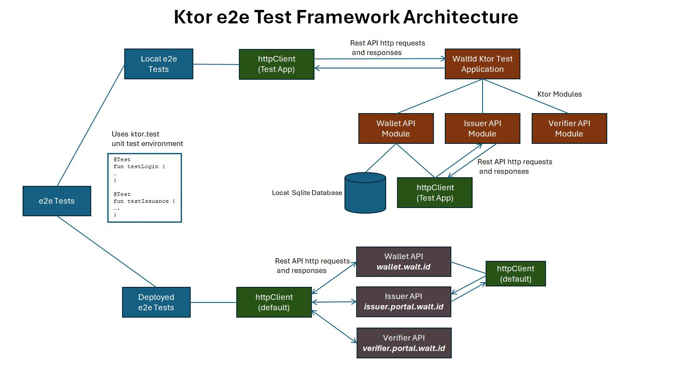
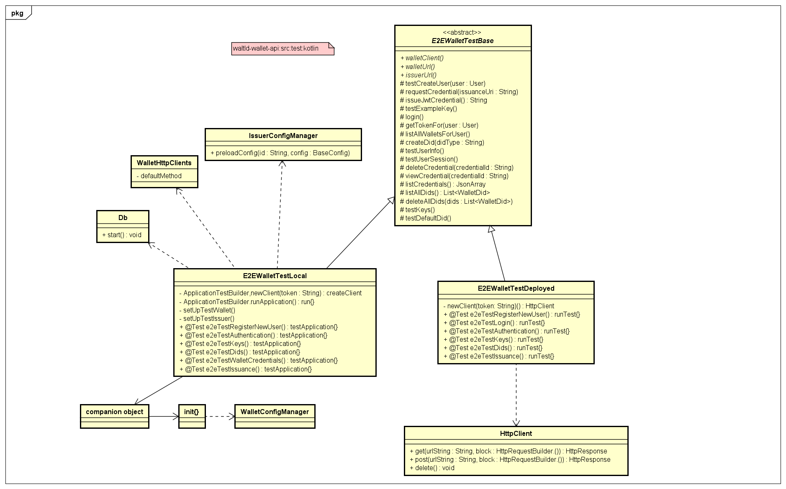

 <h1>Ktor e2e Test Framework</h1>
 
Automates the Testing of all <b>Walt.Id</b> Rest API endpoints and use cases.

## Introduction

The Ktor e2e framework is a kotlin-based set of classes which operate
within the standard junit (kotlin.test.*) environment and so are effectively
unit tests.

However, they differ from standard unit tests in that they exercise the full
end-to-end (e2e) functionality of the various walt.id rest API use cases and/or
endpoints.

The framework currently works with issuer and wallet APIs, the verifier API is
currently being worked on as the next set of tests to add.

## Architecture

The basic idea is to have a base class `E2EWalletTestBase` which provides
the basic test logic for all tests. There are then two subclasses:

* `E2EWalletTestLocal` provides the e2e capability for testing APIs on the local code base, i.e., code on a particuar branch
* `E2EWalletTestDeployed` provides the e2e capability for testing the walt.id deployed APIs, i.e.,
    * Wallet API: `https://wallet.walt.id`
    * Issuer API: `https://issuer.portal.walt.id`

To run the suite of tests within that class, you can either click on the green button (above) from within _intellij IDE_,
or run from the command line using _gradle_. See _Running the Tests_ below.

The following Architecture diagram summarises how the switchable nature of the framework
is implemented.

The HttpClient is a standard (default) client, relying on API ports, for the deployed APIs
but is a custom _ktor Test Application_ HttpClient for the local API tests.

For further information on the ktor Test Application, see:

https://api.ktor.io/ktor-server/ktor-server-test-host/io.ktor.server.testing/test-application.html

As part of the `init{}` block within the local class companion object the local database is configured
and run. This allows custom test data to be used, for example, user, wallet and credential data for
use by the test classes.

The following UML class diagram shows the main classes and funtions implemented within, or used by, the framwework.

The *E2EWalletTestLocal* class uses the `ktor testApplication` to spin up instances of wallet and issuer APIs.
The application provides a custom Http client specifically to be used by the test application.

## Example Use Case: e2eTestWalletCredentials

The `e2eTestWalletCredentials` test suite contains a number of component steps as described:

* `runApplication()`\
  All tests begin with a call to _runApplication_. This function sets up the [ktor] httpClient, initialises
  the database, creates the issuer, wallet and verifier API modules and starts up those servers.  
* `login()`\
  For the tests to work the user must be logged in. There is a call to the base class `login` function
  which in turn invokes the http.post call:
    
  `walletClient.post("$walletUrl/wallet-api/auth/login")`
    

* `getTokenFor()`
  For authorisation purposes on many of the endpoint calls we need the token for
  this user. This function calls login which returns the user token.
    
* `localWalletClient = newClient(token)`
  In local class, calls `newClient()` within the ApplicationTestBuilder ktor class to
  set up a ktor test client.
  In the deployed case, creates a standard http client which can call the deployed servers based on
  port number.
    
* `listAllWalletsForUser()`   
  Each user can have a number of wallets attached to the account. We need to retrieve one to use
  as the correct wallet into which we perform various actions related to DIDs, Keys, credentials etc.
    
* `val availableDids = listAllDids()`
  Lists all the Dids associated with this user wallet.
    
* `val issuanceUri = issueJwtCredential()`
  Issues a jwt credential offer Uri for this wallet. The Uri can then be used to request
  credential issuance from the Issuer API

    
* `requestCredential(issuanceUri, availableDids.first().did)`
  Once the Uri has been issued (see above), it -and an avaiable Did for this user - can be used to request credential
  issuance from the Issuer API. The endpoint called is:
    
  `    /wallet-api/wallet/<walletId>/exchange/useOfferRequest
  `    
    

## Running the Tests

From the /waltid-identity root folder, the wallet-api tests described here can be be run by using
the following command:

`./gradlew :waltid-wallet-api:build
`        

